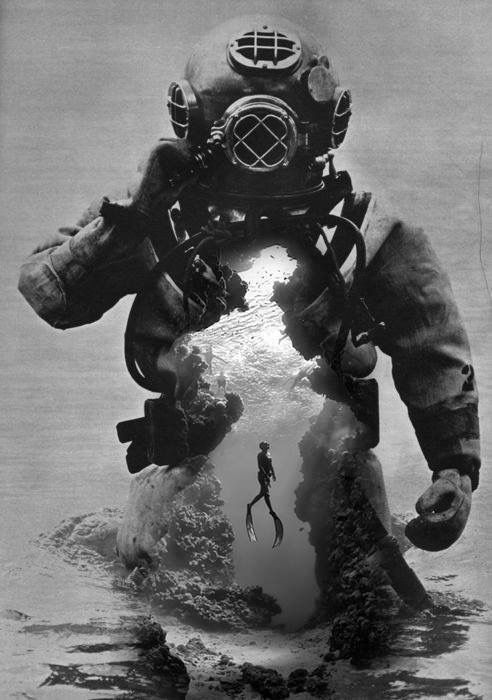

# Planilha
Desafio de uma planilha de gastos pessoais

    

-------

# Projeto Planilha de gasto pessoal

 > ℹ️ **NOTE:** Este é o repositório desenvolvido durante o Bootcamp "Caixa IA Generativa com Microsoft Copilot", no qual fui aluno na plataforma da [DIO](https://dio.me)
  
Projeto com o objetivo de gerar uma planilha de gastos pessoais.

<a href="https://github.com/Alyssoncaio/Ebook-do-zero/blob/main/Output/Ebook_Dark_Web.pdf" title="View PDF now"> 📕Clique aqui para ler</a>

## 💻 Tecnologias utilizadas no projeto

- [Microsoft Office Excel 2007](https://www.office.com/) 
- [Leonardo A.i.](https://leonardo.ai//)  Foi indicado utilizar a ferramenta "Midjourney", porém atualmente 2024/2025 a mesma é paga.
- [Flaticon](https://www.flaticon.com/br/) Ícones para uso na Dashboard  

## 🧠 Prompts

ChatGPT：

|   Ação   | prompt                                                                                                                                                                                                                                                                         |
| :------: | ------------------------------------------------------------------------------------------------------------------------------------------------------------------------------------------------------------------------------------------------------------------------------ |
|  Insights  | Utilize a tabela de dados contida no documento acima, como base de conhecimento e me gere alguns insights dessa tabela de gastos                                                       |
|  |

Leonardo：

|  Ação  | prompt                                                                                 |
| :----: | -------------------------------------------------------------------------------------- |
| título | A hooded figure, known as a hacker, is rummaging through a user's personal information on a website in a dim, eerie, and atmospheric crepuscular environment. |

 

## ✨ Features

- Conteúdo gerado via ChatGPT
- Imagens geradas via Leonardo A.I.

 

## 📚 Materiais

- Imagens utilizadas em `assets`
- ebook gerado durante as aulas em `output`
 

## 👨‍💻 Expert

    
    
&nbsp&nbsp&nbspAlysson Caio 
    &nbsp&nbsp&nbsp
    <a href="https://github.com/Alyssoncaio">
    GitHub</a>&nbsp;|&nbsp;
    &nbsp; &nbsp;
    &nbsp; &nbsp;

  

---

⌨️ [Alysson Caio](https://https://github.com/Alyssoncaio)
